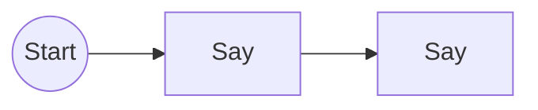
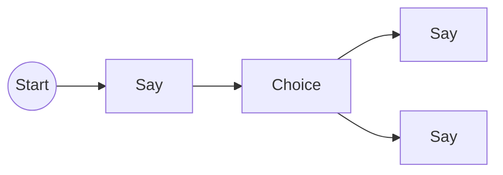
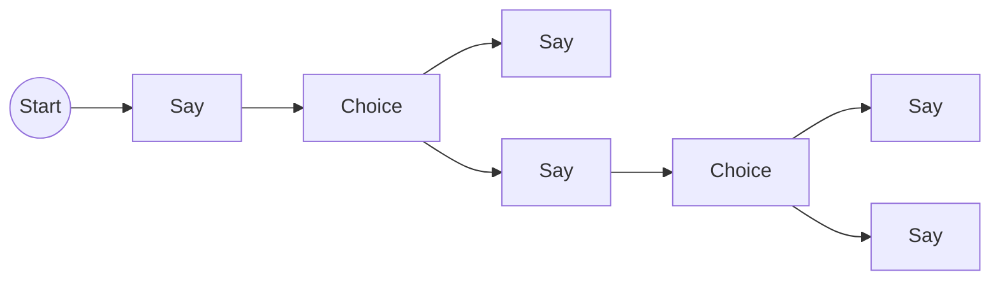
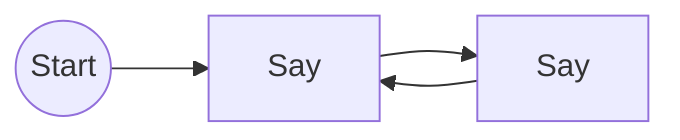
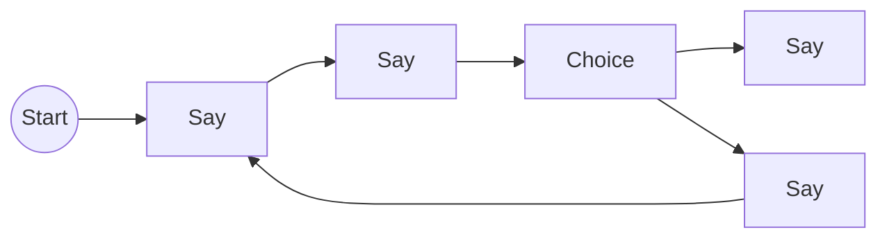
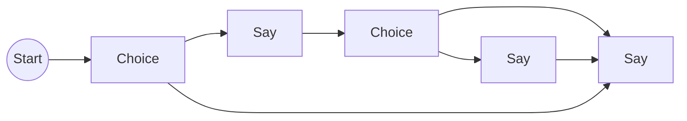

# Creating Talks with TalkBuilder

You can build dialogue graphs programmatically using the `TalkBuilder`. 

> [&#9432;] 
> The `TalkBuilder` is also used under the hood to build the graphs from the asset files.

If you need to generate procedurally dialogue graphs, or you just don't like the asset files, you can use this approach. Otherwise use the `talk.ron` files explained in the [Getting Started](../getting-started/index.md) chapter.

### Simple Usage

Depending on your needs, building a dialogue graph via code can be more or less verbose. 
A simple, linear, conversation such as:



can be built with just a few lines of code:

```rust,no_run
let talk_builder = Talk::builder().say("Hello").say("World");
let talk_commands = commands.talks();
commands.spawn_talk(talk_builder);
```

To actually spawn the entities with the relationships, you pass the `TalkBuilder` to the `Commands::spawn_talk` method, which will prepare a `Command` to be added to the command queue.

The command, when applied, will first spawn the main parent entity of the graph with the `Talk` component. Then add a start node with `StartNode` component (the entry point of the graph) and finally spawn entities for each `say`, `choose` etc.

Usually the builder will connect the entities linearly based on the concatenated methods, with the only exception being the `choose` method which is used for branching. In the example above you would have 3 entities each in a relationship with the next one (start -> say -> say), all children of the main `Talk` entity.

You can check out all the methods that the builder provides in the [API docs](https://docs.rs/bevy_talks/latest/bevy_talks/builder/struct.TalkBuilder.html).

### Build Branching Conversations

The simplest example would be a conversation with just 1 choice node:



```rust,no_run
let talk_builder = Talk::builder();

talk_builder.say("How are you?")
    .choose(vec![
        ("I'm fine", Talk::builder().say("I'm glad to hear that")), 
        ("I'm not fine", Talk::builder().say("I'm sorry to hear that")), 
    ]);
``` 

The `choose` method expects a vector of tuples. The first element is the text field of the choice (to be displayed) and the second is the branch of the conversation, which is another `TalkBuilder` instance.

### Multiple Branches

To make the example a bit more complex, let's say we have another choice in a branch:



```rust,no_run
let talk_builder = Talk::builder();

let happy_branch = Talk::builder().say("I'm glad to hear that");
let sad_branch = Talk::builder()
    .say("Why?")
    .choose(vec![
        ("Jk, I'm fine", Talk::builder().say("Aight")), 
        ("I want an editor!", Talk::builder().say("Me too :("))
    ]);

talk_builder.say("How are you?")
    .choose(vec![("I'm fine", happy_branch), ("I'm not fine", sad_branch)]);
```

It's easy to keep branching but it can get quite verbose and hard to read. 

It is recommended to use the asset files for more complex conversations, but this can be useful if you want to quickly give some lines of texts to an item, or an NPC, or you are generating the conversation procedurally.

### Connecting Nodes Manually

You can connect nodes manually with the `connect_to` method. But you will need to have the node to connect to. 

If for some reason we need a loop like this:



```rust,no_run
let mut talk_builder = Talk::builder().say("Hello");

// grab latest node
let node_a = talk_builder.last_node_id();

talk_builder ? talk_builder.say("World").connect_to(node_a);
```

The `node` method returns an identifier of the node, and we can use it to do manual connections. 
Note you cannot create one node loops since currently self referential relationships are not supported.

You can also chain multiple `connect_to` calls to connect multiple nodes to the same node.

### Branching and Manual Connections

Suppose we want to build this conversation:



Situations like this are somewhat common in games. You are talking to an NPC where only one choice lets you continue 
and the others are just some flavour text or some extra lore. 

```rust,no_run
let mut talk_builder = Talk::builder().say("Hello");

// grab latest node
let convo_start = talk_builder.last_node_id();

talk_builder = talk_builder
    .say("Hey")
    .choose(vec![
        ("Good Choice", Talk::builder().say("End of the conversation")),
        ("Wrong Choice", Talk::builder().say("Go Back").connect_to(convo_start))
    ]);
 ```

### Connecting To The Same Node

Imagine you want to land on a node from multiple places like this:



You have an initial choice that can take the player to the end of the conversation, or go for some chat and then another choices which either goes to the end or passes by a talk node first.

You can think of that last talk node as its own branch that is pointed by multiple nodes. 

```rust,no_run
let end_branch_builder = Talk::builder().say("The End"); // Create the end immediately
let end_node_id = end_branch_builder.last_node_id(); // <- grab the end node

// Create the good path
let good_branch = Talk::builder().say("something").choose(vec![
    ("Bad Choice", Talk::builder().connect_to(end_node_id.clone())),
    (
        "Another Good Choice", 
        Talk::builder().say("Before the end...").connect_to(end_node_id)
    ),
]);

let builder = Talk::builder().choose(vec![
    ("Good Choice", good_branch),
    // NB the builder is passed here. If we never add it and keep using connect_to
    // the end node would never be created
    ("Bad Choice", end_branch_builder) 
]);
```

### Adding Actors to the mix

We saw the builder in action with just the `say` method, but we can also have actors say stuff. 
First we need to add the actors to the builder:

```rust,no_run
let mut talk_builder = Talk::builder()
    .add_actor("bob", "Bob")
    .add_actor("alice", "Alice");
```

Then we can use the `actor_say` method (or `actors_say` for multiple actors at once):

```rust,no_run
talk_builder = talk_builder.actor_say("bob", "Hello")
    .actor_say("alice", "Hi Bob");
```

The first argument is the actor slug. If the builder doesn't have an actor with that slug, it will panic when building. So always make sure to add the correct actors first. Also there is a `actors_say` method that takes a vector of actors slug.

Actors can also "join" or "leave" the conversation. For that there are the relative methods `join` and `leave`:

```rust,no_run
talk_builder = talk_builder.add_actor("bob", "Bob")
    .join("bob")
    .actor_say("bob", "Folks, it do be me.");
```

### Node Event Emitters

The dialogue graph emits events when a node is reached. The way it does that is by using the `NodeEventEmitter` trait for the node components that implement it. 

```rust,no_run
/// Trait to implement on dialogue node components to make them emit an event when reached.
#[bevy_trait_query::queryable]
pub trait NodeEventEmitter {
    /// Creates an event to be emitted when a node is reached.
    fn make(&self, actors: &[Actor]) -> Box<dyn Reflect>;
}
```

In case of `say`, `choose`, `join` and `leave` the builder will spawn an entity and add the `TextNode`, `ChoiceNode`, `JoinNode` and `LeaveNode` components respectively. Each of these components implement the `NodeEventEmitter` trait.

The idea is that you can create a `Component`, implement the trait so you can create an `Event` (optionally injecting the active actors) and then use that event to trigger some logic in your game.

You can check out the [`custom_node_event`](https://github.com/giusdp/bevy_talks/blob/main/examples/custom_node_event.rs) example to see how to implement custom events. You will see that there is also a macro to help you with that and that you need to register the component (and event) with the `app.register_node_event::<C, T>()`.

### Custom Node Components

Related to the previous section, you can also add any custom components to a node with the `with_component` method:

```rust,no_run
#[derive(Component, Reflect, Default)]
#[reflect(Component)]
struct MyCustomComponent {
    pub some: bool,
}

talk_builder = Talk::builder().say("Hello").with_component(MyCustomComponent::default());
```

This will add the component to the node entity, but remember to register the component type first with `app.register_type::<MyCustomComponent>();`.

Going one step further, you can do a completely customized node by creating one empty first and then adding components to it:

```rust,no_run
let builder = Talk::builder().empty_node().with_component(MyCustomComponent::default());
```

You could create any kind of entity graph this way!
