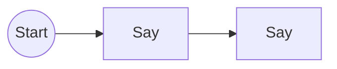
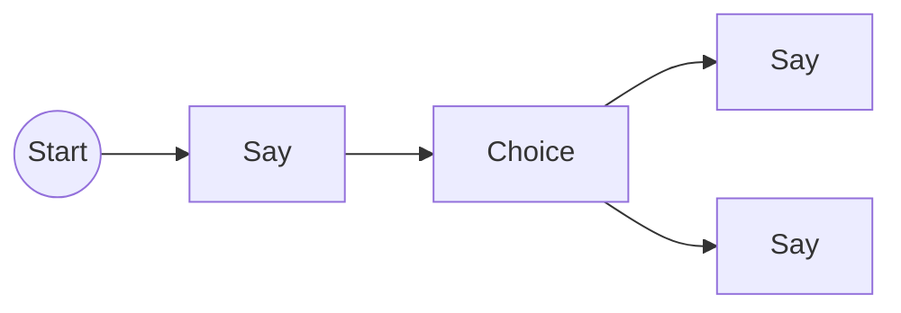
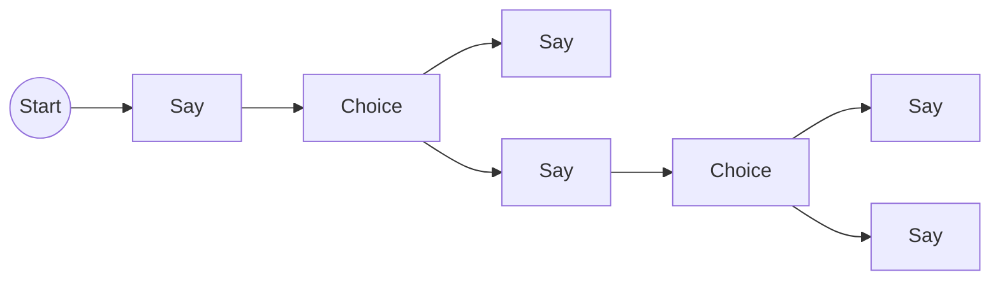
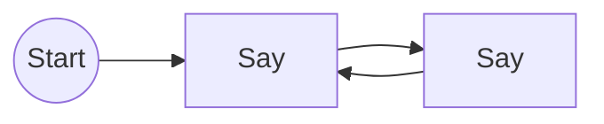
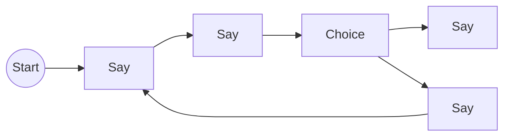

# Talk Builder

You can build dialogue graphs programmatically using an implementation of the builder pattern: `TalkBuilder`. 

> [&#9432;] 
> The `TalkBuilder` is also what is used under the hood to build the graphs from the asset files.

If you need to generate procedurally dialogue graphs, or you just don't like the asset files, you can use this approach.

### Simple Usage

Depending on your needs, building a dialogue graph via code can be more or less verbose. 
A simple, linear, conversation such as:



can be built with just a few lines of code:

```rust
let talk_builder = Talk::builder().say("Hello").say(bob, "World");
let build_cmd = talk_builder.build();
```

The `build` method generates a Bevy `Command` callled `BuildTalkCommand` that you can `add` to the command queue in your systems.

The command, when applied, will first spawn the `TalkStart` entity, then for each `say` an entity with a `TalkNodeBundle`. It also connects the entities linearly with a relationship forming a dialogue graph. In the example above you would have 3 entities each in a relationship with the next one.

You can check out all the methods that the builder provides in the [API docs](https://docs.rs/bevy_talks/latest/bevy_talks/builder/struct.TalkBuilder.html).

### Build Branching Conversations

The builder normally just chains the nodes one after the other as you call the methods. If, instead, you need to connect a node to multiple other nodes (e.g. a choice node) you'll have to start branching.

The simplest example would be a conversation with just 1 choice node:



```rust
let talk_builder = Talk::builder();

talk_builder.say("How are you?")
    .choose(vec![
        ("I'm fine".to_string(), Talk::builder().say("I'm glad to hear that")), 
        ("I'm notfine".to_string(), Talk::builder().say("I'm sorry to hear that")), 
    ]);

let talk_root_entity = talk_builder.build();
``` 

The `choose` method expects a vector of tuples. The first element is the text field of the choice (to be displayed) and the second is the branch of the conversation, which effectively is another `TalkBuilder` instance.

### Multiple Branches

To make the example a bit more complex, let's say we have another choice in a branch:



```rust
let talk_builder = Talk::builder();

let happy_branch = Talk::builder().say("I'm glad to hear that");
let sad_branch = Talk::builder().say("Why?")
                .choose(vec![
                    ("Jk, I'm fine".to_string(), happy_branch.clone()), 
                    ("I want an editor!".to_string(), Talk::builder().say("Me too :("))
                ]);

talk_builder.say("How are you?")
    .choose(vec![
        ("I'm fine".to_string(), happy_branch), 
        ("I'm not fine".to_string, sad_branch),
    ]);

let build_command = talk_builder.build();
```

As you can see, it's easy to keep branching the conversation and you can also reuse branches. The problem with this approach is that it can get quite verbose and hard to read. 

It is recommended to use the asset files for more complex conversations, but this can be useful if you want to quickly give some lines of texts to an item, or an NPC, or you are generating the conversation procedurally.


### Connecting Nodes Manually

You can connect nodes manually with the `connect_to` method. But you will need to have the node to connect to. 

If for some reason we need a loop like this:



```rust
let talk_builder = Talk::builder();
let node_a = talk_builder.say("Hello").node();
talk_builder.say("World").connect_to(node_a).build(&app.world);
```

The `node` method returns an identifier of the node, and we can use it to do manual connections. 
Note you cannot create one node loops since currently self referential relationships are not supported.

You can also chain multiple `connect_to` calls to connect multiple nodes to the same node.

### Branching and Manual Connections

Suppose we want to build this conversation:



Situations like this are somewhat common. You are talking to an NPC where only one choice lets you continue 
and the others are just some flavour text or some extra lore. 

```rust
let talk_builder = Talk::builder();

let convo_start = talk_builder.say("Hello").node();

convo_start
    .say("Hey")
    .choice(vec![
        Choice {
            text: "Good Choice",
            branch: Talk::builder()
                .say("End of the conversation")
                .branch(),
        },
        Choice {
            text: "Wrong Choice",
            branch: Talk::builder()
                .say("Go Back")
                .connect_to(convo_start)
                .branch(),
        }
    )
    .build(&app.world);
 ```