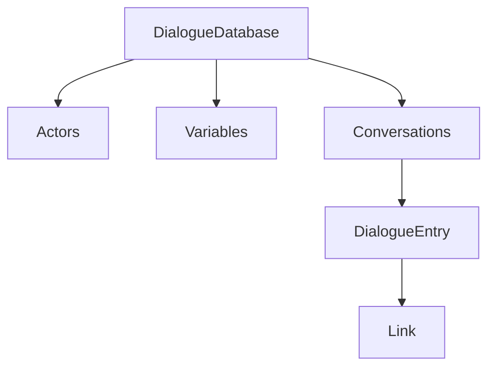

# The Dialogue Database

A `DialogueDatabase` is the unit of authored content: one asset holding the cast and every conversation that plays against it.



## Actors

```rust,ignore
pub struct Actor {
    pub id: ActorId,        // unique within the database
    pub name: String,
    pub is_player: bool,
    pub fields: Vec<Field>, // custom data
}
```

`is_player` matters at runtime: entries spoken by player actors become menu choices, entries spoken by everyone else are presented as lines.

## Variables

```rust,ignore
pub struct Variable {
    pub name: String,        // unique within the database
    pub initial: FieldValue, // what it starts as
    pub fields: Vec<Field>,  // custom data
}
```

Named game-state values and what they start as. At runtime they seed the [`Variables` store](../runtime/variables.md).

## Conversations

```rust,ignore
pub struct Conversation {
    pub id: ConversationId,   // unique within the database
    pub title: String,        // the human-facing handle, used to start it
    pub actor: ActorId,       // default speaker
    pub conversant: ActorId,  // default listener
    pub entries: Vec<DialogueEntry>,
    pub fields: Vec<Field>,
}
```

## Entries

An entry is one node of the conversation graph:

```rust,ignore
pub struct DialogueEntry {
    pub id: EntryId,          // unique within its conversation
    pub actor: ActorId,       // who speaks
    pub conversant: ActorId,  // who is spoken to
    pub menu_text: String,    // label when offered as a choice
    pub dialogue_text: String,// the spoken line
    pub is_root: bool,        // the conversation's entry point
    pub is_group: bool,       // organizational pass-through node
    pub links: Vec<Link>,
    pub fields: Vec<Field>,
}
```

- Exactly one entry per conversation should be the **root** (the starting point). Its own text is never displayed.
- **Group** entries carry no dialogue of their own: at runtime they are transparent, and evaluation flows straight through their links. Use them to
  organize large graphs.
- `menu_text` and `dialogue_text` are separate so a choice can read differently in the menu ("Ask about the ship") than when spoken 
  ("So... what's the deal with the ship?"). If `menu_text` is empty, menus fall back to `dialogue_text`.

## Links

```rust,ignore
pub struct Link {
    pub dest_conversation: ConversationId,
    pub dest_entry: EntryId,
}
```

A link is a directed edge to any entry, including entries of *other* conversations, which lets long dialogue be split into manageable pieces.
Link order is meaningful: menus offer choices in link order.

## Custom fields

Every actor, conversation, and entry carries a `fields` bag:

```rust,ignore
pub struct Field {
    pub title: String,
    pub value: FieldValue, // Text | Number | Boolean | Localization | Actor
}
```

Fields are the extension point for anything the core schema doesn't model: game-specific metadata, localized text variants, editor data. 
The editor itself stores node canvas positions as `canvas_x`/`canvas_y` number fields.
