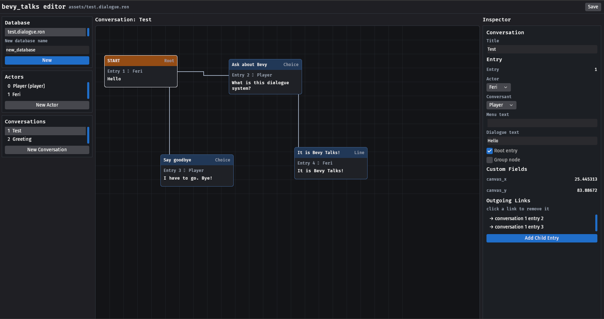

# The Editor

The repository ships a visual editor as Bevy app, built on the bevy_feathers.

> **⚠** `bevy_talks_editor` is really experimental and badly put together. It's currently a quick hack just to visually edit the ron files.
```sh
cargo run -p bevy_talks_editor
```

It edits the files in the repository's `assets/` folder.



## Working the graph

| Gesture | Effect |
|---|---|
| Click a node | inspect that entry |
| Drag a node | move it (positions persist as `canvas_x`/`canvas_y` fields) |
| Right-click a node | link the *selected* entry to it |
| **Add Child Entry** (inspector) | new entry linked from the inspected one, with speaker and listener swapped |
| **Delete Entry** (inspector) | removes the entry and every link pointing at it |
| Click a row under *Outgoing Links* | removes that link |

Entry text is edited in the inspector: menu text, dialogue text, the
root/group flags, and dropdowns assigning the speaking and listening actor.