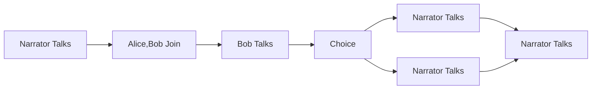

# Introduction to Bevy Talks

> [&#9432;]
> Be aware that `bevy_talks`'s API is still undergoing revisions (with possibly big architectural changes). Feedback on its ergonomics and developer experience (DX) is highly appreciated.

This [Bevy][bevy] plugin provides a way to create dialogues and conversations in your game as graphs. 

You can imagine a *Talk* between the player and NPCs as a directed graph where each node is an *action* that can be performed 
such as saying a line, joining/leaving the conversation, or a choice the player can make.

The most common action is text being displayed on the screen, and a simple *Talk* is
just a sequence of texts forming a conversation between actors.

You can have multiple entities each with their own *Talk* graph. Or you can make a VN-like game with one single big dialogue graph in the game.

> [!NOTE]
> A more in-depth documentation is being slowly written as an [mdbook here!](https://giusdp.github.io/bevy_talks/) Help is appreciated :)

## Actions and Actors

Talks are made up of actions that are translated into graph nodes. 
Actions can be defined either via the `TalkBuilder` (where you have more control over the dialogue graph with custom components and events) or with "talk.ron" asset files. With the latter, you are building dialogue nodes by passing `Action` data:

```rust
struct Action {
    /// The ID of the action.
    id: ActionId,
    /// The kind of action.
    action: NodeKind,
    /// The actors involved in the action.
    actors: Vec<ActorSlug>,
    /// Any choices that the user can make during the action.
    choices: Option<Vec<Choice>>,
    /// The text of the action.
    text: Option<String>,
    /// The ID of the next action to perform.
    next: Option<ActionId>,
}
```

It contains several fields that define the kind of action it can be, the relevant actors, text or choices and the next action to perform (where to go in the graph after).

The actors are quite simple right now. It is just the name and an identifier (the slug):

```rust
struct Actor {
    /// The name of the actor.
    name: String,
    /// The unique slug of the actor.
    slug: ActorSlug,
}
```

Having a well defined *Talk* with actions and actors will result in spawning a graph where all the nodes are entities.
Each action will be an entity "node", and each actor is also an entity. 

All the action nodes will be connected with each other with an aery relationship (called *FollowedBy*), following the graph structure given by the actions next and id fields, and each action with actors will result in the corresponding entity being connected with the actors entities with another aery relationship (called *PerformedBy*).


## The Parent Talk

All the node entities in the graph will be a child of a main entity that represents the *Talk* itself, with the *Talk* component attached to it.

You can think of this parent Talk entity as it "encapsulates" the graph and you can use it to identify a dialogue graph. You will use it to send events to advance the dialogue.

## Build Talks from talk.ron files

The above-mentioned ron assets files are used to create `TalkData` assets. They can be used to build dialogue graphs via bevy `Commands`. 

The files must have the extension: `talk.ron`. Here's an example:

```rust,ignore
(
    actors: [
        ( slug: "bob", name: "Bob" ),
        ( slug: "alice", name: "Alice" )
    ],
    script: [
        ( id: 1, action: Talk, text: Some("Bob and Alice enter the room."), next: Some(2) ),
        ( id: 2, action: Join, actors: [ "bob", "alice" ], next: Some(3)),
        ( id: 3, actors: ["bob"], text: Some("Hello, Alice!"), next: Some(4) ), // without the action field, it defaults to Talk
        (
            id: 4,
            choices: Some([
                ( text: "Alice says hello back.", next: 5 ),
                ( text: "Alice ignores Bob.", next: 6 ),
            ])
        ),
        ( id: 5, text: Some("Bob smiles."), next: Some(7)), // without the actors field, it defaults to an empty vector
        ( id: 6, text: Some("Bob starts crying."), next: Some(7) ),
        ( id: 7, text: Some("The end.") ) // without the next, it is an end node
    ]
)
```

The plugin adds an `AssetLoader` for these ron files, so it's as easy as: 

```rust
let handle: Handle<TalkData> = asset_server.load("simple.talk.ron");
```

Then you can use `Talk::builder()` to create a `TalkBuilder`, which has the `fill_with_talk_data` method. 
You can retrieve the `TalkData` from the assets collection `talks: Res<Assets<TalkData>>`.

With the builder ready, you can use the Commands extension to spawn the dialogue graph in the world:

```rust
use bevy::prelude::*;
use bevy_talks::prelude::*;

// We stored the previously loaded handle of a TalkData asset in this resource
#[derive(Resource)]
struct TalkAsset {
    handle: Handle<TalkData>,
}

fn spawn(mut commands: Commands, talks: Res<Assets<TalkData>>, talk_asset: Res<TalkAsset>) {
    let talk = talks.get(&talk_asset.handle).unwrap();
    let talk_builder = TalkBuilder::default().fill_with_talk_data(simple_talk);

    // spawn the talk graph
    commands.spawn_talk(talk_builder, ());
}
```

Spawning that talk graph will result in this:



## Usage

Besides building dialogue graphs, at some point you have to interact with them. 
After all the nodes are entities with components, so you could just do queries using the special `CurrentNode` component that keeps track of the current node. Then each node could have a `TextNode`, `JoinNode`, `LeaveNode`, `ChoiceNode` or your own custom components (added via the builder). 

Another way is to use a dialogue graph in an event-driven way. The plugin sends events every time you move to a new node based on the components it has. A node with a `TextNode` will send a `TextNodeEvent` event, a node with a `ChoiceNode` will send a `ChoiceEvent` event, and so on. You can also add your own node emitting components to customize the behaviour.

For example, to display the text of a `TextNode` you can simply listen to the `TextNodeEvent` event:

```rust
fn print_text(mut text_events: EventReader<TextNodeEvent>) {
    for txt_ev in text_events.read() {
        let mut speaker = "Narrator";
        println!("{}", txt_ev.text);
    }
}
```
Note that the actors connected to the node are injected in the event, so you don't need to query them.

### Request Events

That's the events from a dialogue graph to you. There is also the other direction so you can send requests to the dialogue graph (to advance the dialogue).

To move forward to the next action:

```rust
/// Event to request the next node in a `Talk`.
/// It requires an entity with the `Talk` component you want to update.
#[derive(Event)]
pub struct NextNodeRequest  {
    /// The entity with the `Talk` component you want to update.
    pub talk: Entity,
}
```

To jump to a specific action (used with choices):

```rust
/// An event to jump to some specific node in a graph. 
/// It requires an entity with the `Talk` component you want to update.
#[derive(Event)]
pub struct ChooseNodeRequest {
    /// The entity with the `Talk` component you want to update.
    pub talk: Entity,
    /// The next entity to go to.
    pub next: Entity,
}
```

There is also an useful event to re-send all the events associated to a node:

```rust
/// Event to request the current node to re-send all its events.
#[derive(Event)]
pub struct RefireNodeRequest {
    /// The entity with the `Talk` component you want to update.
    pub talk: Entity,
}
```

You pass the entity with the `Talk` component in these events, plus the next node entity in case of the choose event.

Check out the `examples` folder to see how to use the plugin.

- [simple.rs](examples/simple.rs) shows how to use the plugin to create a simple, linear conversation. 
- [choices.rs](examples/choices.rs) shows how to use the plugin to create a conversation with choices (jumps in the graph).
- [full.rs](examples/full.rs) shows a Talk where all the action kinds are used.
- [ingame.rs](examples/ingame.rs) shows how to use the plugin with more than one talk you can interact with.
- [custom_node_event.rs](examples/custom_node_event.rs) shows how to add your own event emitting component to create a custom node.

### Roadmap

Some nice-to-haves from the top of my head:

- [x] More node kinds (got rid of node kinds, now nodes are entities with components)
- [x] Extensive documentation/manual wiki (added an mdbook, but always in progress...)
- [x] Extensible Interaction/Trigger system (I mean I'm using events, more decoupled than this is impossible)
- [ ] Use the built-in bevy_ecs relations (when one day when we will have them)
- [ ] Dialogue UIs 
- [ ] Graphical editor to create the asset files
- [ ] Voice lines/sound support
- [ ] Support other asset formats (yarn?)
- [ ] More examples
- [ ] Localization with [Fluent](https://projectfluent.org/)

### Bevy Version Support

Compatibility of `bevy_talks` versions:
| `bevy_talks` | `bevy` |
| :--                 |  :--   |
| `main`              | `0.12`  |
| `0.5.0`              | `0.12`  |
| `0.4.0`              | `0.12`  |
| `0.3.1`              | `0.12`  |
| `0.3.0`              | `0.11`  |
| `0.2.0`              | `0.11`  |
| `0.1.1`              | `0.11`  |
| `bevy_main`              | `main`  |

## License

Dual-licensed under either of

- Apache License, Version 2.0, ([LICENSE-APACHE](/LICENSE-APACHE) or https://www.apache.org/licenses/LICENSE-2.0)
- MIT license ([LICENSE-MIT](/LICENSE-MIT) or https://opensource.org/licenses/MIT)

at your option.

## Contribution

Unless you explicitly state otherwise, any contribution intentionally submitted
for inclusion in the work by you, as defined in the Apache-2.0 license, shall be dual licensed as above, without any
additional terms or conditions.
