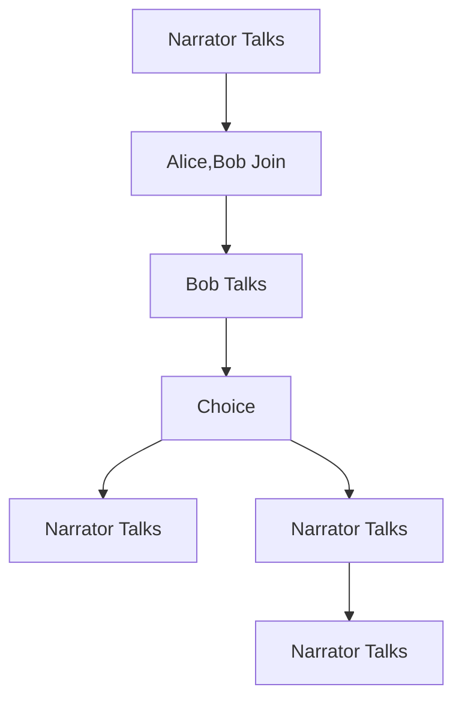

# Introduction to Bevy Talks

[![][img_bevy]][bevycrate] 
[![][img_license]][license] 
[![][img_tracking]][tracking] 
[![][img_version]][crates]
[![][img_doc]][doc] 
[![][img_downloads]][crates]

> [!WARNING]  
> Be aware that `bevy_talks`'s API is still undergoing revisions (with possibly big architectural changes). Feedback on its ergonomics and developer experience (DX) is highly appreciated.

This [Bevy][bevy] plugin provides a way to create dialogues and conversations in your game as graphs. 

You can imagine a *Talk* between the player and NPCs as a directed graph where each node is an *action* that can be performed 
such as saying a line, joining/leaving the conversation, or a choice the player can make.

The most common action is text being displayed on the screen, and a simple *Talk* is
just a sequence of texts forming a conversation between actors.

You can have multiple entities each with their own *Talk* graph. Or you can make a VN-like game with one single big dialogue graph in the game.

> [!NOTE]
> A more in-depth documentation is being slowly written as an [mdbook here!](giusdp.github.io/bevy_talks/) Help is appreciated :)

## Actions and Actors

Talks are made up of actions that are translated into graph nodes. 
Actions can be defined either via the `TalkBuilder` of with asset files and they have this form:

```rust
struct Action {
    /// The ID of the action.
    id: ActionId,
    /// The kind of action.
    action: NodeKind,
    /// The actors involved in the action.
    actors: Vec<ActorSlug>,
    /// Any choices that the user can make during the action.
    choices: Option<Vec<Choice>>,
    /// The text of the action.
    text: Option<String>,
    /// The ID of the next action to perform.
    next: Option<ActionId>,
}
```

You won't be writing this struct directly, but you can see that it contains several fields that define the kind of action it can be, the relevant actors, text or choices and the next action to perform (where to go in the graph after).

The actors are quite simple right now. It is just the name and an identifier (the slug).

The `Actor` struct is a simple struct that contains the name of the actor and the asset to display on the screen.

```rust
struct Actor {

    /// The name of the actor.
    name: String,
    /// The unique slug of the actor.
    slug: ActorSlug,
}
```

Having a well defined *Talk* with actions and actors will result in spawning a graph where all the nodes are entities.
Each action will be an entity "node", and each actor is also an entity. 

All the action nodes will be connected with each other with a aery relationship (called *FollowedBy*), following the graph structure given by the actions next and id fields, and each action with actors will result in the corresponding entity being connected with the actors entity with another aery relationship (called *PerformedBy*).

Finally all the action entities in the graph will be a child of a main entity that represents the *Talk* itself, with the *Talk* component attached to it.

### The Talk Component

This parent Talk component that "encapsulates" the graph is the main component that you will use to interact with the dialogue system.
With it you can keep track of the current node data, and use it to send events to advance the dialogue (through the related entity).

```rust
/// The Talk component. It's used to identify the parent entity of dialogue entity graphs.
#[derive(Component, Debug)]
pub struct Talk {
    /// The text of the current node (if not a Talk node it's empty)
    pub current_text: String,
    /// The kind of the current node
    pub current_kind: NodeKind,
    /// The actor(s) name of the current node
    pub current_actors: Vec<String>,
    /// The choices of the current node (if not a Choice node it's empty)
    pub current_choices: Vec<Choice>,
}
```

### Build Talks from talk.ron files

The plugin can parse ron files to create `TalkData` assets, which can then be used to build the graph. 
The files must have the extension: `talk.ron`.

Here's an example:

```rust,ignore
(
    actors: [
        ( slug: "bob", name: "Bob" ),
        ( slug: "alice", name: "Alice" )
    ],
    script: [
        ( id: 1, action: Talk, text: Some("Bob and Alice enter the room."), next: Some(2) ),
        ( id: 2, action: Join, actors: [ "bob", "alice" ], next: Some(3)),
        ( id: 3, actors: ["bob"], text: Some("Hello, Alice!"), next: Some(4) ), // without the action field, it defaults to Talk
        (
            id: 4,
            choices: Some([
                ( text: "Alice says hello back.", next: 5 ),
                ( text: "Alice ignores Bob.", next: 6 ),
            ])
        ),
        ( id: 5, text: Some("Bob smiles."), next: Some(6)), // without the actors field, it defaults to an empty vector
        ( id: 6, text: Some("Bob starts crying."), next: Some(7) ),
        ( id: 7, text: Some("The end.") ) // without the next, it is an end node
    ]
)
```

The plugin adds an `AssetLoader` for these ron files, so it's as easy as: 

```rust
let handle: Handle<TalkData> = asset_server.load("simple.talk.ron");
```

Then you can use `Talk::builder()` to create a `TalkBuilder`, which has the `fill_from_talk_data` method. 
You can retrieve the `TalkData` from the assets collection `talks: Res<Assets<TalkData>>`.


With the builder ready, you can use the Commands extension to spawn the dialogue graph in the world:

```rust
use bevy::prelude::*;
use bevy_talks::prelude::*;

// We stored the previously loaded handle of a TalkData asset in this resource
#[derive(Resource)]
struct TalkAsset {
    handle: Handle<TalkData>,
}

fn spawn(mut commands: Commands, talks: Res<Assets<TalkData>>, talk_asset: Res<TalkAsset>) {
    let talk = talks.get(&talk_asset.handle).unwrap();
    let talk_builder = TalkBuilder::default().fill_from_talk_data(simple_talk);

    // grab the talk commands
    let mut talk_commands = commands.talks();
    // spawn the talk graph
    talk_commands.spawn_talk(talk_builder, ());
}
```

Spawning that talk graph will result in this:




### Usage

With the `Talk` component you can get the current text/actor/choices for the current action in a talk. 
Together with the Change Detection System, you can react to changes in the `Talk` component to update your UI.

```rust
fn print_text(talks: Query<Ref<Talk>>) {
    for talk in talks.iter() {
        if text.is_changed() && talk.current_kind == NodeKind::Talk {
            println!("{}", text.text());
        }
    }
}
```

To interact with the dialogue graphs you can send 2 different events to advance the Talk to the next node or to jump to a specific node:

To move forward to the next action:

```rust
pub struct NextActionRequest(pub Entity);
```

To jump to a specific action (used with choices):

```rust
pub struct ChooseActionRequest {
    /// The entity with the [`Talk`] component you want to update.
    pub talk: Entity,
    /// The next entity to go to.
    pub next: Entity,
}
```

You pass the entity with the `Talk` component in these events, plus the next node entity in case of the choose event.

Check out the `examples` folder to see how to use the plugin.

- [simple.rs](examples/simple.rs) shows how to use the plugin to create a simple, linear conversation. 
- [choices.rs](examples/choices.rs) shows how to use the plugin to create a conversation with choices (jumps in the graph).
- [full.rs](examples/full.rs) shows a Talk where all the action kinds are used.
- [ingame.rs](examples/ingame.rs) shows how to use the plugin with more than one talk you can interact with.

### Roadmap

Some nice-to-haves from the top of my head:

- [ ] Use the built-in bevy_ecs relations (when one day we will have them)
- [ ] Dialogue UIs 
- [ ] Extensible Interaction/Trigger system (to activate/advance dialogues)
- [ ] Graphical editor to create the asset files
- [ ] Voice lines/sound support
- [ ] More node kinds (and a custom node kind system)
- [ ] Support other asset formats (?)
- [ ] More examples
- [ ] Extensive documentation/manual wiki (always in progress...)
- [ ] Localization with [Fluent](https://projectfluent.org/)

### Bevy Version Support


Compatibility of `bevy_talks` versions:
| `bevy_talks` | `bevy` |
| :--                 |  :--   |
| `main`              | `0.12`  |
| `0.4.0`              | `0.12`  |
| `0.3.1`              | `0.12`  |
| `0.3.0`              | `0.11`  |
| `0.2.0`              | `0.11`  |
| `0.1.1`              | `0.11`  |
| `bevy_main`              | `main`  |

## License

Dual-licensed under either of

- Apache License, Version 2.0, ([LICENSE-APACHE](/LICENSE-APACHE) or https://www.apache.org/licenses/LICENSE-2.0)
- MIT license ([LICENSE-MIT](/LICENSE-MIT) or https://opensource.org/licenses/MIT)

at your option.

## Contribution

Unless you explicitly state otherwise, any contribution intentionally submitted
for inclusion in the work by you, as defined in the Apache-2.0 license, shall be dual licensed as above, without any
additional terms or conditions.

[bevy]: https://bevyengine.org/
[renpy]: https://www.renpy.org/

[img_bevy]: https://img.shields.io/badge/Bevy-0.12.1-blue
[img_version]: https://img.shields.io/crates/v/bevy_talks.svg
[img_doc]: https://docs.rs/bevy_talks/badge.svg
[img_license]: https://img.shields.io/badge/license-MIT%2FApache-blue.svg
[img_downloads]:https://img.shields.io/crates/d/bevy_talks.svg
[img_tracking]: https://img.shields.io/badge/Bevy%20tracking-released%20version-lightblue

[bevycrate]: https://crates.io/crates/bevy/0.12.1
[crates]: https://crates.io/crates/bevy_talks
[doc]: https://docs.rs/bevy_talks/
[license]: https://github.com/giusdp/bevy_talks#license
[tracking]: https://github.com/bevyengine/bevy/blob/main/docs/plugins_guidelines.md#main-branch-tracking
