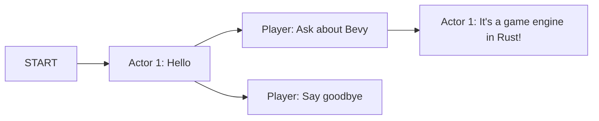

# Introduction

> **⚠** `bevy_talks` is in development. The API described here is young and will change. Feedback is very welcome.

`bevy_talks` is a dialogue system for [Bevy](https://bevyengine.org). It gives
your game:

- **A dialogue database asset**: actors and conversations authored as `.dialogue.ron` files, loaded through the Bevy asset server.
- **Conversations as graphs**: each conversation is a directed graph of  entries: spoken lines, player choices, and organizational group nodes, connected by links.
- **A runtime that plays them**: spawn a `DialogueRunner`, observe the events it emits, and render them however your game wants.
- **A variable store**: a `Variables` resource seeded from the database, the shared game state that dialogue and gameplay read and write.
- **A visual editor**: a Bevy app for authoring databases: a node canvas for the conversation graph, an inspector for entries and actors, and save/load.

## The shape of a conversation

Every conversation starts at its **root entry** and flows along links. An
entry spoken by a non-player actor is presented as a line; when the only ways
forward are entries spoken by a player actor, they are offered as a choice
menu. When there are no links left, the conversation ends.

```mermaid
graph LR
    START --> hello["Actor 1: Hello"]
    hello --> ask["Player: Ask about Bevy"]
    hello --> bye["Player: Say goodbye"]
    ask --> answer["Actor 1: It's a game engine in Rust!"]
```

## Where to go next

- [Getting Started](./getting-started.md) — play your first conversation.
- [The Dialogue Database](./concepts/database.md) — the data model.
- [Playing Conversations](./runtime/playing.md) — the runtime in detail.
- [The Editor](./editor.md) — authoring without writing RON by hand.
