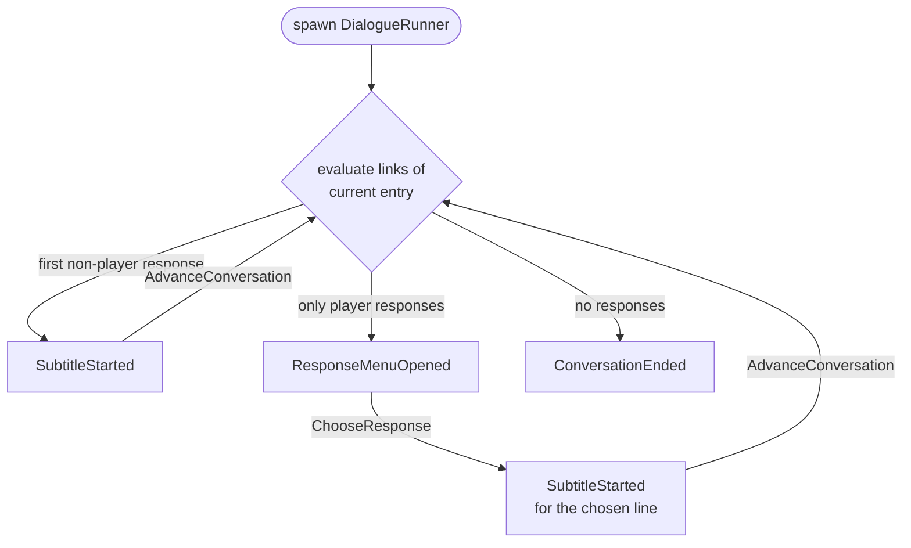

# Playing Conversations

## The runner

A conversation plays on a **runner entity**. Spawning it is starting it:

```rust,ignore
commands.spawn(DialogueRunner::new(
    database_handle,
    ConversationRef::Title("Greeting".to_owned()), // or ConversationRef::Id(..)
));
```

The runner waits until the database asset is loaded, finds the conversation, and steps from its root entry. 
From then on it is a small state machine, exposed as `runner.phase`:

- `Starting`: waiting for the asset.
- `Presenting`: a line is on screen; waiting for `AdvanceConversation`.
- `AwaitingChoice`: a menu is open; waiting for `ChooseResponse`.
- `Ended`: done. 

> **⚠** The DialogueRunner entity stays alive in `Ended` phase. Despawning it is your call.

## Events

All communication happens through entity events on the runner.

**Emitted by the runner** (observe globally with `app.add_observer`, or on the runner entity with `.observe`):

| Event | Payload | Meaning |
|---|---|---|
| `SubtitleStarted` | `subtitle`, `speaker`, `listener` | present this line |
| `ResponseMenuOpened` | `responses` | present this choice menu |
| `ConversationEnded` | | nothing follows |

**Triggered by the game**:

| Event | Meaning |
|---|---|
| `AdvanceConversation { entity }` | the current line is done, continue |
| `ChooseResponse { entity, index }` | pick the `index`-th offered response |

Inputs in the wrong phase (advancing while a menu is open, an out-of-range index) are logged and ignored.

## The flow



The stepping rules:

- Links are evaluated **in order**.
- If any reachable response is spoken by a **non-player** actor, the first one wins and is presented as the next line.
- Otherwise, all reachable **player** responses become the menu, labeled with `menu_text`. 
  The chosen entry is then presented as a spoken line before stepping onward.
- No responses means the conversation ends.
- The root entry's own text is skipped; conversations effectively begin at whatever the root links to.
